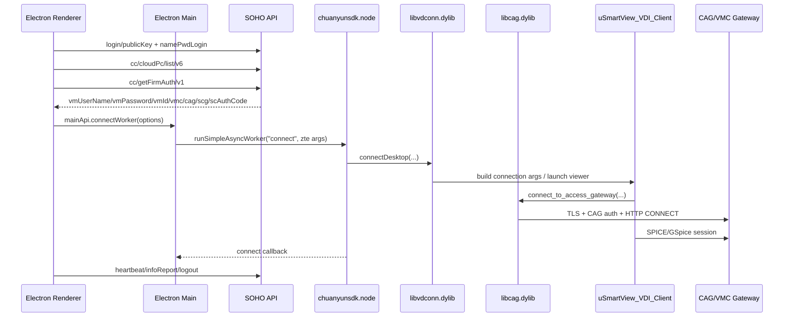

# 移动云电脑 ZTE 分支协议还原笔记

本文档只记录本地样本和日志能证明的协议链路、函数边界和验证点，不包含可直接复刻远控连接或绕过平台空闲关机策略的保活实现。

## 当前样本结论

- App 版本: `2.18.21`
- Bundle ID: `com.komect.soho`
- 当前日志命中的云电脑类型: `spuCode=zte-cloud-pc`
- 当前实际远控分支: `chuanyunAddOn-zte`
- 非当前分支: `chuanyunAddOn` 内的 `jwae.framework`/SCG Trunk 线索存在，但本日志没有命中该路径。

## 分层链路



## 控制面协议

控制面由 Electron 负责，核心接口来自 `src/renderer/src/constants/index.js` 和日志：

- `/login/encryptKey/v1` 或 `/login/publicKey/v1`: 获取登录加密公钥。
- `/login/home/namePwdLogin/v1` 或 `/login/namePwdLogin/v1`: 账号密码登录。
- `/cc/cloudPc/list/v6`: 拉取云电脑列表。
- `/cc/getFirmAuth/v1`: 点击连接后获取厂商连接参数。
- `/cc/cloudPc/heartbeat/v2`: 远控连接后周期心跳。
- `/cc/cloudPc/infoReport/v2`: 远控连接后信息上报。
- `/cc/cloudPc/logout/v2`: 断开远控后上报退出。

`getFirmAuth` 返回结构只保留字段形态：

```text
vmUserName, vmPassword, vmId, vmcIp, vmcPort,
cagIp, cagPort, scgIp, scgTcpPort, scgUdpPort,
spuCode, bizCode, scAuthCode
```

日志证据显示，当前连接分支里 `scgIp/scgTcpPort/scgUdpPort` 可以为空或 0，实际使用的是 `cagIp:cagPort` 和 `vmcIp:vmcPort`。

## Electron 到 Native 边界

源码路径：

- `cloudpc_extract/src/main/index.js`
- `移动云电脑.app/Contents/Resources/app.asar.unpacked/node_modules/chuanyunAddOn-zte/jsCysdk.js`
- `移动云电脑.app/Contents/Resources/app.asar.unpacked/node_modules/chuanyunAddOn-zte/ccsdk/mac/SohoSdk.h`

分支逻辑：

- `spuCode` 包含 `zte-`: 调用 `zteWorker.connect(...)`
- `spuCode` 包含 `wave-`: Windows 分支拉起 `CloudPC.exe`
- 其他: 调用通用 `chuanyunAddOn/connectVm`

ZTE native 导出：

```c
connectDesktop(vmUserName, vmPassword, vmId, vmcIp, vmcPort, cagIp, cagPort, callback)
disconnectDesktop(vmId, callback)
restartDesktop(vmUserName, vmPassword, vmId, vmcIp, vmcPort, cagIp, cagPort, callback)
```

IDA 对应入口：

- `P0_chuanyunsdk_zte.node`: `SimpleAsyncWorker::Execute`
- `P0_libvdconn.dylib`: `ClientManager::SohoSdk_StartConnectDesktop`
- `P0_libvdconn.dylib`: `ClientManager::StartSpiceProcess`

## ZTE 数据面协议还原

### 1. 连接字符串与 viewer 启动

`libvdconn.dylib` 负责把控制面参数转成 viewer 连接参数，并启动/驱动嵌入的 `uSmartView_VDI_Client`。

IDA 证据：

- `ClientManager::StartSpiceProcess`
- `ClientManager::ConnectStrAesEncode`
- `buildCAGParam`
- `AddCagAndInternalParm`

可见命令参数线索：

- `--guest-usr`
- `--guest-passwd`
- `--vmid`
- CAG/VMC 相关参数

`StartSpiceProcess` 内部会调用连接串解码/编码函数，例如 `AesDecodeConnStrFromCsap`、`AesCbcEncode`、`AesEncodeForCsap`。这说明 ZTE 分支不是直接把明文连接参数裸传给 viewer，而是在本地 native 层做了一层连接串封装。

### 2. CAG 接入网关握手

`uSmartView_VDI_Client` 依赖 `libcag.dylib`，CAG 相关函数名较完整：

- `connect_to_access_gateway`
- `send_access_gateway_local_key`
- `recv_access_gateway_key`
- `send_access_gateway_connect_info`
- `generate_http_msg`
- `create_http_tunnel_proxy`
- `tn_deal_aes_code`
- `xor_with_key`

从 IDA 和日志能确认的顺序：

```text
connect_to_access_gateway
  -> send_access_gateway_local_key
  -> recv_access_gateway_key
  -> send_access_gateway_connect_info
  -> create_http_tunnel_proxy
  -> 后续 viewer 走 SPICE/GSpice
```

关键静态证据：

- `send_access_gateway_local_key` 构造以 `ZTEC,` 开头的本地 key/auth 包。
- `recv_access_gateway_key` 日志包含 `recv server key from cag success, key = ..., aes_flag = ...`。
- `send_access_gateway_connect_info` 对用户名和密码做加密处理。
- 密码路径里可见 `xor_with_key(..., 99)` 后再进入 AES 处理。
- `tn_deal_aes_code` 使用 OpenSSL AES 接口，按 `aes_flag` 选择 AES 参数。
- `generate_http_msg` 构造 `CONNECT host:port HTTP/1.1`。
- `create_http_tunnel_proxy` 负责把 CAG 隧道转成到 `vmcIp:vmcPort` 的 HTTP CONNECT 隧道。

### 3. SPICE/GSpice 会话

`uSmartView_VDI_Client` 内包含大量 SPICE 相关符号，并链接/内嵌 SPICE 客户端库能力：

- `spice_session_*`
- `spice_channel_*`
- `spice_display_channel_*`
- `surface_create`
- `display_primary_surface_destroyed_signal_cb`
- 键鼠输入: `send_key_event_to_spice`、`sendTouch2Spice`
- 外设: `libusbredirect`、`libclipboard_mac`、`libusbMsg`

这说明 ZTE 分支最终数据面是：

```text
Electron 控制面参数
  -> libvdconn 本地连接串封装
  -> libcag 接入网关认证和隧道
  -> uSmartView/SPICE 远控会话
```

## 连接成功和心跳证据

客户端日志中，远控成功不是以 `getFirmAuth` 成功为准，而是 native callback 为准：

```text
connect: iCode=0, msg=Success to Connectting desktop
connect: iCode=0, msg=Success to Connect desktop
```

之后 Electron 侧开始：

- `/cc/cloudPc/heartbeat/v2`
- `/cc/cloudPc/infoReport/v2`

当前日志中 `heartbeat` 曾返回：

```text
code=4041, msg=当前云电脑处于解锁状态,且无密码(A90020129)
```

这说明 heartbeat 是平台业务态上报，不等同于底层 CAG/SPICE 链路本身。实际“在线/占用/空闲”判定需要同时观察：

- native 连接状态 callback
- CAG 隧道是否仍连接
- SPICE display/session 是否建立
- SOHO heartbeat/infoReport 是否持续
- 断开时是否触发 `/cc/cloudPc/logout/v2`

## 与 jwae/SCG 分支的区别

本地 `chuanyunAddOn` 通用分支确实包含：

- `libChuanyunSDK.dylib`
- `jwae.framework`
- `spice-client-glib-2.0.8.framework`
- CEM/OAuth/getConnectInfo/getVmReadyStatus 字符串
- trunk/TLS/auth 字符串

但当前日志返回的是：

```text
spuCode=zte-cloud-pc
cagIp/cagPort 有值
vmcIp/vmcPort 有值
scgIp/scgTcpPort/scgUdpPort 为空或 0
```

因此当前机器的实际连接应按 ZTE/CAG 分支分析，不应直接按 `jwae.framework` 的 SCG Trunk 协议实现。

## 后续验证点

如果只做协议分析，下一步建议验证这些点：

1. Proxyman 重新清空会话后，从登录到点击连接完整抓一次控制面，确认 `getFirmAuth` 和后续 heartbeat 的时间关系。
2. `tcpdump/lsof` 同步抓 native 数据面，确认 `uSmartView_VDI_Client` 到 `cagIp:cagPort`、`vmcIp:vmcPort` 的连接顺序。
3. 在 IDA 里继续给 `libcag.dylib` 的 CAG 参数结构体命名，辅助解释日志和 pcap，而不是直接生成连接器。
4. 如果账号后续出现非 `zte-*` 的 `spuCode`，再切换到 `jwae.framework`/`libChuanyunSDK.dylib` 分支分析。

## 可复跑命令

重新生成脱敏分析报告：

```bash
python3 cloudpc_flow_analyzer.py --force --log 1.log
```

只分析指定日志，不扫默认本地日志：

```bash
python3 cloudpc_flow_analyzer.py --force --skip-default-logs --log 1.log
```

